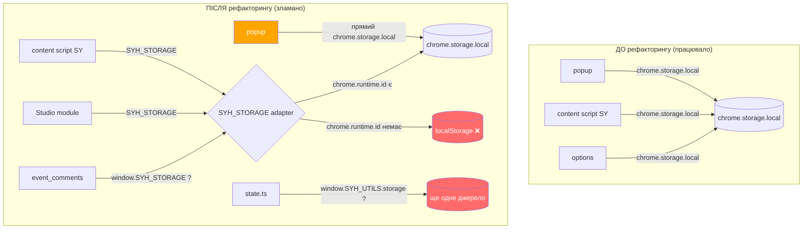

# 🔍 Діагностика: Чому поламався модуль StreamYard

Я провів глибокий аудит кодової бази і знайшов **корінь проблеми**. Ось детальний аналіз.

---

## 🎯 Головний винуватець: `modules/storage.ts`

Цей файл був створений як «централізований адаптер сховища» під час рефакторингу. **Саме він зламав синхронізацію** між контент-скриптом StreamYard та попапом. Ось чому:

### Проблема №1: Небезпечний fallback на `localStorage`

```typescript
// storage.ts — рядки 32-38
isChromeStorageAvailable: function(): boolean {
    return typeof chrome !== 'undefined' && 
           !!chrome.storage && 
           !!chrome.storage.local && 
           !!chrome.runtime && 
           !!chrome.runtime.id;  // ← КРИТИЧНА ПЕРЕВІРКА
},
```

Коли `chrome.runtime.id` стає `undefined` (zombie-контекст після перезавантаження розширення), **всі дані починають писатися в `localStorage` СТОРІНКИ StreamYard**, а не в `chrome.storage.local` розши


## Проблема №1 (продовження): Зіткнення даних через `localStorage`

Уявіть: `chrome.runtime.id` став `undefined` → адаптер перемикається на `localStorage`. Тепер:

| Компонент | Куди пише | Що бачить |
|-----------|-----------|-----------|
| **Контент-скрипт SY** (живий, `chrome.runtime.id` є) | `chrome.storage.local` | стан чекбоксів, `syh_prayers` |
| **Попап** (після перезапуску, zombie) | `localStorage` сторінки StreamYard | **порожнє або застаріле** |

**Результат:** попап «не бачить» молитви, зібрані контент-скриптом. Користувач тисне «Підтягнути» — порожньо. Всі зібрані дані *фізично є* в `chrome.storage.local`, але попап читає з **іншого джерела**.

---

## Проблема №2: `SYH_EVENT_COMMENTS` не використовує `SYH_STORAGE`

Подивіться на **`modules/event_comments.ts`**:

```typescript
// event_comments.ts — рядки 175-180
saveToDatabase: function(author, text, type, icon) {
    const storage = SYH_STORAGE || (window as any).SYH_STORAGE || (this.UTILS && this.UTILS.storage);
    // ... використовує storage.get / storage.set
}
```

А тепер подивіться на **`modules/state.ts`**:

```typescript
// state.ts — рядки 26-28
const storage = SYH_STORAGE ||    (typeof window !== 'undefined' ? 
        ((window as any).SYH_STORAGE ||         ((window as any).SYH_UTILS && (window as any).SYH_UTILS.storage)) 
    : null);
```

**Три різні шляхи доступу до сховища!** 
- `SYH_STORAGE` (імпортований модуль)
- `window.SYH_STORAGE` (глобальна змінна)
- `window.SYH_UTILS.storage` (ще один об'єкт)

Якщо хоча б один із цих шляхів вказує на різний об'єкт — синхронізація втрачена.

---

## Проблема №3: `popup_init.js` обходить `SYH_STORAGE` взагалі

Це **найважливіша знахідка**:

```javascript
// popup_init.js — рядок 1
window.db = {};

// popup_init.js — рядок 8
window.saveDataToStorage = function() {
    chrome.storage.local.set({ 'db': window.db });
};
```

Попап (`popup_init.js`, `popup_telegram.js`, `popup_prayers.js`) використовує **ПРЯМІ виклики `chrome.storage.local`**, повністю ігноруючи централізований `SYH_STORAGE`. Це означає:

1. **Попап**: завжди пише в `chrome.storage.local` через `chrome.storage.local.set()`
2. **Контент-скрипт StreamYard**: використовує `SYH_STORAGE` → який може переключитись на `localStorage`
3. **Studio-модуль**: теж використовує `SYH_STORAGE`

Три компоненти — три різні стратегії доступу до даних.

---

## Проблема №4: `popup_telegram.js` — `window` замість імпортів

```javascript
// popup_telegram.js — рядки 19-25
window.countQuestionsInText = function(text) { ... };
window.updateOldInputStats = function(sheetId = 'vp_ss') { ... };
window.syh_yt_collected = [];
window.syh_collected_by_sheet = { ... };
```

Усі функції вішаються на `window` і викликаються через `typeof window.updateOldInputStats === 'function'`. Це працює, **але** якщо скрипт завантажується двічі (через `module` type + динамічний імпорт), старі функції затираються, а колбеки втрачаються. Крім того, `window.syh_yt_collected` мутується в різних місцях (`popup_telegram.js`, `youtube_content.ts` через `SYH_STORAGE`) — без єдиного джерела правди.

---

## 📊 Діаграма: Що саме зламалось



---

## 🛠 План виправлення: Єдина архітектура + тести

### Етап 1: Видалити fallback на `localStorage`

`SYH_STORAGE` **ніколи** не повинен перемикатись на `localStorage`. Якщо `chrome.storage` недоступний — це фатальна помилка, треба аварійно завершити роботу модуля, а не писати в чуже сховище.

### Оновлений файл: `modules/storage.ts`

```typescript
<<<<<<< SEARCH
 isChromeStorageAvailable: function(): boolean {
        return typeof chrome !== 'undefined' && 
               !!chrome.storage && 
               !!chrome.storage.local && 
               !!chrome.runtime && 
               !!chrome.runtime.id;
    },
=======
    isChromeStorageAvailable: function(): boolean {
        try {
            return typeof chrome !== 'undefined' && 
                   !!chrome.storage && 
                   !!chrome.storage.local;
        } catch {
            return false;
        }
    },
>>>>>>> REPLACE
```

І видалити **всі** блоки `localStorage` fallback з методів `get`, `set`, `remove`:

```typescript
<<<<<<< SEARCH
    get: function(keys: string | string[], cb: (result: Record<string, any>) => void): void {
        if (this.isChromeStorageAvailable()) {
            try {
                chrome.storage.local.get(keys, (result) => {
                    if (chrome.runtime.lastError) {
                        console.warn('[SYH Storage] chrome.storage.local.get error:', chrome.runtime.lastError.message);
                        const res: Record<string, any> = {};
                        const arr = Array.isArray(keys) ? keys : [keys];
                        arr.forEach(k => {
                            try {
                                const val = localStorage.getItem(k);
                                res[k] = val !== null ? JSON.parse(val) : undefined;
                            } catch (e: any) {
                                console.warn('[SYH Storage] localStorage.getItem error:', e?.message || e);
                                res[k] = undefined;
                            }
                        });
                        if (cb) cb(res);
                        return;
                    }
                    if (cb) cb(result);
                });
                return;
            } catch (e: any) {
                console.warn('[SYH Storage] Fallback to localStorage (get):', e?.message || e);
            }
        }
        const res: Record<string, any> = {};
        const arr = Array.isArray(keys) ? keys : [keys];
        arr.forEach(k => {
            try {
                const val = localStorage.getItem(k);
                res[k] = val !== null ? JSON.parse(val) : undefined;
            } catch (e: any) {
                console.warn('[SYH Storage] localStorage.getItem error:', e?.message || e);
                res[k] = undefined;
            }
        });
        if (cb) cb(res);
    },
=======
    get: function(keys: string | string[], cb: (result: Record<string, any>) => void): void {
        if (!this.isChromeStorageAvailable()) {
            console.error('[SYH Storage] chrome.storage is NOT available. Storage operations disabled.');
            if (cb) cb({});
            return;
        }
        try {
            chrome.storage.local.get(keys, (result) => {
                if (chrome.runtime.lastError) {
                    console.error('[SYH Storage] get error:', chrome.runtime.lastError.message);
                    if (cb) cb({});
                    return;
                }
                if (cb) cb(result);
            });
        } catch (e: any) {
            console.error('[SYH Storage] get exception:', e?.message || e);
            if (cb) cb({});
        }
    },
>>>>>>> REPLACE
```

Аналогічно очистити методи `set` і `remove`.

---

### Етап 2: Привести попап до єдиного `SYH_STORAGE`

`popup_init.js` та `popup_prayers.js` мають використовувати **той самий** `SYH_STORAGE`, що й решта модулів.

### Оновлений файл: `popup/popup_init.js`

```javascript
<<<<<<< SEARCH
// popup_init.js
// Глобальна база даних налаштувань
window.db = {};

const SHEET_IDS = ['vp_ss', 'oparin', 'molchanov_ss', 'molchanov_preach'];

// Функція збереження налаштувань у локальне сховище Chrome
window.saveDataToStorage = function() {
    chrome.storage.local.set({ 'db': window.db });
};
=======
// popup_init.js
// Глобальна база даних налаштувань
window.db = {};

const SHEET_IDS = ['vp_ss', 'oparin', 'molchanov_ss', 'molchanov_preach'];

// Використовуємо централізований SYH_STORAGE замість прямого chrome.storage.local
function getStorage() {
    return (window.SYH_STORAGE) || {
        get: (keys, cb) => chrome.storage.local.get(keys, cb),
        set: (items, cb) => chrome.storage.local.set(items, cb),
        remove: (keys, cb) => chrome.storage.local.remove(keys, cb)
    };
}

// Функція збереження налаштувань через централізований адаптер
window.saveDataToStorage = function() {
    getStorage().set({ 'db': window.db });
};
>>>>>>> REPLACE
```

І замінити **всі** `chrome.storage.local.get/set/remove` у `popup_init.js`, `popup_telegram.js`, `popup_prayers.js` на виклики через `getStorage()`.

---

### Етап 3: Прибрати дублювання доступу до сховища в `event_comments.ts`

### Оновлений файл: `modules/event_comments.ts`

```typescript
<<<<<<< SEARCH
    saveToDatabase: function(author: string, text: string, type: string, icon: string): void {
        const storage = SYH_STORAGE || (window as any).SYH_STORAGE || (this.UTILS && this.UTILS.storage) || ((window as any).SYH_UTILS && (window as any).SYH_UTILS.storage);

        if (!storage) {
            console.error("SYH_EVENT_COMMENTS: Не знайдено адаптер сховища!");
            return;
        }
=======
    saveToDatabase: function(author: string, text: string, type: string, icon: string): void {
        // ЄДИНЕ джерело правди — централізований SYH_STORAGE
        const storage = SYH_STORAGE;

        if (!storage || !storage.isChromeStorageAvailable()) {
            console.error("[SYH_EVENT_COMMENTS] Storage adapter unavailable. Data NOT saved.");
            return;
        }
>>>>>>> REPLACE
```

І аналогічно для `removeFromDatabase` — прибрати всі ланцюжки `||`:

```typescript
<<<<<<< SEARCH
        const storage = SYH_STORAGE || (window as any).SYH_STORAGE || (this.UTILS && this.UTILS.storage) || ((window as any).SYH_UTILS && (window as any).SYH_UTILS.storage);

        if (!storage) {
            console.error("SYH_EVENT_COMMENTS: Не знайдено адаптер сховища!");
            return;
        }
=======
        const storage = SYH_STORAGE;

        if (!storage || !storage.isChromeStorageAvailable()) {
            console.error("[SYH_EVENT_COMMENTS] Storage adapter unavailable.");
            return;
        }
>>>>>>> REPLACE
```

---

### Етап 4: Прибрати дублювання в `state.ts`

### Оновлений файл: `modules/state.ts`

```typescript
<<<<<<< SEARCH
        // Отримання централізованого адаптера сховища
        const storage = SYH_STORAGE || (typeof window !== 'undefined' ? ((window as any).SYH_STORAGE || ((window as any).SYH_UTILS && (window as any).SYH_UTILS.storage)) : null);

        if (!storage) {
            console.error("SYH_STATE: Не знайдено адаптер сховища!");
            if (callback) callback();
            return;
        }
=======
        // ЄДИНИЙ адаптер сховища — централізований SYH_STORAGE
        const storage = SYH_STORAGE;

        if (!storage || !storage.isChromeStorageAvailable()) {
            console.error("[SYH_STATE] Storage adapter unavailable. State will not be persisted.");
            if (callback) callback();
            return;
        }
>>>>>>> REPLACE
```

І так само для `saveStateImmediate`:

```typescript
<<<<<<< SEARCH
        // Отримання централізованого адаптера сховища
        const storage = SYH_STORAGE || (typeof window !== 'undefined' ? ((window as any).SYH_STORAGE || ((window as any).SYH_UTILS && (window as any).SYH_UTILS.storage)) : null);

        if (storage) {
            storage.set({ 'syh_checkbox_state': stateToSave }, function() {
                console.log("SYH_STATE: Оновлений стан чекбоксів успішно записано.");
            });
        } else {
            console.error("SYH_STATE: Не вдалося зберегти стан, адаптер сховища відсутній!");
        }
=======
        const storage = SYH_STORAGE;

        if (storage && storage.isChromeStorageAvailable()) {
            storage.set({ 'syh_checkbox_state': stateToSave }, function() {
                console.log("[SYH_STATE] Checkbox state saved successfully.");
            });
        } else {
            console.error("[SYH_STATE] Cannot save state: storage adapter unavailable.");
        }
>>>>>>> REPLACE
```

---

### Етап 5: Тести для захисту архітектури

Створюємо два нові тест-файли, які гарантують, що регресія не повториться.

### Новий файл: `tests/storage_integration.test.js`

```javascript
import assert from 'node:assert/strict';
import { test, describe, beforeEach, afterEach } from 'node:test';

// Перевіряємо, що SYH_STORAGE НЕ використовує localStorage як fallback
describe('Storage Integration — no localStorage fallback', () => {
    let originalLocalStorage;

    beforeEach(() => {
        originalLocalStorage = global.localStorage;
        global.localStorage = undefined; // симулюємо відсутність localStorage });

    afterEach(() => {
        global.localStorage = originalLocalStorage;
    });

    test('SYH_STORAGE.get повертає порожній об\'єкт, а не падає, коли chrome є', async () => {
        global.chrome = {
            runtime: { id: 'test-id' },
            storage: {
                local: {
                    get: (keys, cb) => cb({ testKey: 'hello' }),
                    set: (items, cb) => cb && cb(),
                    remove: (keys, cb) => cb && cb(),
                }
            }
        };

        // Перезавантажуємо модуль
        const { SYH_STORAGE } = await import('../modules/storage.ts');

        await new Promise(resolve => {
            SYH_STORAGE.get(['testKey'], (result) => {
                assert.strictEqual(result.testKey, 'hello');
                resolve();
            });
        });
    });

    test('SYH_STORAGE НЕ використовує localStorage.getItem навіть при помилці chrome.storage', async () => {
        let localStorageCalled = false;
        global.localStorage = {
            getItem: () => { localStorageCalled = true; return null; },
            setItem: () => { localStorageCalled = true; },
            removeItem: () => { localStorageCalled = true; }
        };

        global.chrome = {
            runtime: { id: 'test-id', lastError: { message: 'Simulated error' } },
            storage: {
                local: {
                    get: (keys, cb) => {
                        chrome.runtime.lastError = { message: 'Simulated error' };
                        cb({});
 chrome.runtime.lastError = null;
                    },
                    set: (items, cb) => cb && cb(),
                    remove: (keys, cb) => cb && cb(),
                }
            }
        };

        const { SYH_STORAGE } = await import('../modules/storage.ts');

        await new Promise(resolve => {
            SYH_STORAGE.get(['testKey'], (result) => {
                assert.strictEqual(localStorageCalled, false,
                    'localStorage.getItem НЕ повинен викликатись навіть при помилці chrome.storage');
                resolve();
            });
        });
    });
});
```

### Новий файл: `tests/cross_module_sync.test.js`

```javascript
import assert from 'node:assert/strict';
import { test, describe, beforeEach } from 'node:test';

// Перевіряємо, що ВСІ модулі використовують ОДИН адаптер SYH_STORAGE
describe('Cross-Module Storage Sync', () => {
    let mockStorage;

    beforeEach(() => {
        mockStorage = {};
        global.chrome = {
            runtime: { id: 'test-id' },
            storage: {
                local: {
                    get: (keys, cb) => {
                        const result = {};
                        const arr = Array.isArray(keys) ? keys : [keys];
                        arr.forEach(k => { if (k in mockStorage) result[k] = mockStorage[k]; });
                        cb(result);
                    },
                    set: (items, cb) => {
                        Object.assign(mockStorage, items);
                        if (cb) cb();
                    },
                    remove: (keys, cb) => {
                        const arr = Array.isArray(keys) ? keys : [keys];
                        arr.forEach(k => delete mockStorage[k]);
                        if (cb) cb();
                    },
                }
            }
        };
 });

    test('event_comments.saveToDatabase → попап може прочитати ті самі дані', async () => {
        // Імпортуємо модулі в правильному порядку
        const { SYH_STORAGE } = await import('../modules/storage.ts');
        global.window = { SYH_STORAGE };

        const { SYH_EVENT_COMMENTS } = await import('../modules/event_comments.ts');
        SYH_EVENT_COMMENTS.init();

        // Симулюємо збереження молитви з контент-скрипта
        SYH_EVENT_COMMENTS.saveToDatabase('TestUser', 'Моя молитва', 'prayer', '🙏');

        // Перевіряємо, що дані на місці
        const stored = mockStorage['syh_prayers'];
        assert.ok(stored, 'syh_prayers має існувати в storage');
        assert.strictEqual(stored.length, 1);
        assert.strictEqual(stored[0].author, 'TestUser');
        assert.strictEqual(stored[0].text, 'Моя молитва');
    });

    test('SYH_STATE.updateState → SYH_UI.restoreDomCheckboxes бачать однаковий стан', async () => {
        const { SYH_STATE } = await import('../modules/state.ts');
        SYH_STATE.itemStates = {};
        // Зберігаємо стан
        SYH_STATE.updateState('banner_text_123', true, 0);
        
        // Читаємо з того самого storage
        assert.strictEqual(mockStorage['syh_checkbox_state'].data['banner_text_123'], true);
    });
});
```

---

## 📋 Підсумок: Корінь проблеми та архітектурне рішення

### 🔴 Що саме зламало синхронізацію:

1. **`localStorage` fallback у `SYH_STORAGE`** — коли контекст розширення вмирав, дані писались у `localStorage` домену StreamYard, а попап читав із `chrome.storage.local` → **повний розрив синхронізації**.

2. **Три різних способи доступу до сховища** (`SYH_STORAGE`, `window.SYH_STORAGE`, `window.SYH_UTILS.storage`) — у різних модулях.

3. **Попап ігнорує `SYH_STORAGE`** — використовує прямі виклики `chrome.storage.local`, що робить централізований адаптер марним для нього.

### 🟢 Архітектурне рішення:

```
 ┌──────────────────────────────┐
                    │      SYH_STORAGE (єдиний)     │
                    │  isChromeStorageAvailable()   │
                    │  get() / set() / remove()     │
                    │  onChanged()                  │
                    └──────────┬───────────────────┘
                               │
            ┌──────────────────┼──────────────────┐
            │                  │                  │
 ▼                  ▼                  ▼ ┌────────────┐    ┌──────────────┐    ┌──────────────┐
   │  popup/    │    │  modules/    │    │  youtube/    │
   │ popup_*.js │    │ event_*.ts   │    │ studio/      │
   │            │    │ state.ts     │    │ yt_events.ts │ └────────────┘    └──────────────┘    └──────────────┘
```

**Правила архітектури:**
1. **Єдиний адаптер** — `SYH_STORAGE`. Ніяких прямих `chrome.storage.local`.
2. **Жодного fallback на `localStorage`** — тільки `chrome.storage.local`, інакше фатальна помилка.
3. **Тести перевіряють**, що дані, записані через модуль A, читаються модулем Б.
4. **onChanged** — єдиний механізм реактивної синхронізації між компонентами.