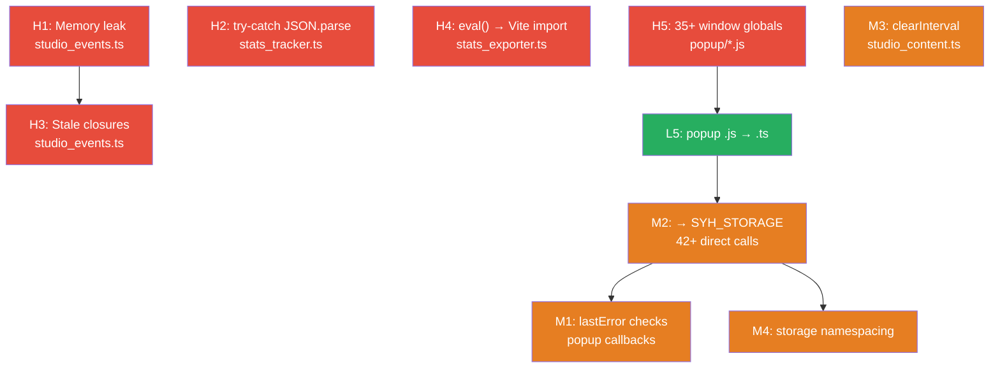

# 📋 Список задач — Повний план рефакторингу

**Дата створення:** 2026-08-02  
**Автор задач:** Antigravity (Claude Opus 4.6 Thinking)  
**Джерело аналізу:** [audit_battle_evaluation.md](file:///d:/Chrome%20Extension/Время%20перемен.%20Chrome%20Extension/streamyars-copy-buttons%20(added%20checkbox)%200.6-2026.01.11/docs/рефактор/2026-08-01%20-%20пошук%20хто%20винен%20в%20поломці%20за%202026-07-31/2%20-%20аудит%20Gemini%20різними%20-%20батл/__Opus%20-%20оцінив%20всіх%20-%20і%20дав%20ще%20свій%20--%20audit_battle_evaluation.md)  
**Проєкт:** StreamYard Helper Chrome Extension v1.0.0

---

## 📊 Загальний статус

| Рівень | Всього | ✅ Done | 🔄 WIP | ⬜ TODO | Оцінка зусиль |
|:-------|:------:|:------:|:------:|:------:|:--------------:|
| 🔴 HIGH (Критичні) | 5 | 0 | 0 | 5 | ~12 год |
| 🟠 MEDIUM (Архітектурні) | 4 | 0 | 0 | 4 | ~8 год |
| 🟢 LOW (Технічний борг) | 10 | 0 | 0 | 10 | ~16 год |
| **Всього** | **19** | **0** | **0** | **19** | **~36 год** |

### 🗺️ Граф залежностей задач



> [!NOTE]
> Стрілки `→` означають "задача A повинна бути виконана перед задачею B". Наприклад, H1 (memory leak) і H3 (stale closures) стосуються одного файлу — H1 варто робити першим, бо він змінює структуру listeners.

---

## 🔴 HIGH — Критичні проблеми

---

### H1: Memory leak — накопичення document-level click listeners

| | |
|---|---|
| **Файл** | [studio_events.ts#L270-L280](file:///d:/Chrome%20Extension/Время%20перемен.%20Chrome%20Extension/streamyars-copy-buttons%20(added%20checkbox)%200.6-2026.01.11/youtube/studio/studio_events.ts#L270-L280) |
| **Складність** | 🟡 Середня (~2 год) |
| **Залежності** | Нема. Виконувати **перед** H3 (той самий файл). |
| **Статус** | ⬜ TODO |

**Проблема:** `bindStudioCommentEvents()` додає `document.addEventListener('click', ...)` для закриття dropdown **при кожному виклику**. Функція викликається для кожного коментаря при віртуальному скролінгу. За сесію — сотні дублюючих listeners.

**Impact:** CPU overhead на кожен клік (сотні handlers спрацьовують одночасно) + memory leak.

**Рішення:** Глобальний одноразовий listener:
```typescript
// ❌ ЗАРАЗ — всередині bindStudioCommentEvents(), множиться:
document.addEventListener('click', (e) => {
    if (!dropdown.contains(e.target)) dropdown.style.display = 'none';
});

// ✅ ПІСЛЯ — один раз при ініціалізації модуля:
let activeDropdown: HTMLElement | null = null;

document.addEventListener('click', (e) => {
    if (activeDropdown && !activeDropdown.contains(e.target as Node)) {
        activeDropdown.style.display = 'none';
        activeDropdown = null;
    }
});

// У bindStudioCommentEvents() — лише оновлювати activeDropdown:
toggleBtn.addEventListener('click', () => {
    activeDropdown = dropdown;
    dropdown.style.display = 'block';
});
```

**Критерії приймання:**
- [ ] `document.addEventListener('click')` викликається рівно **1 раз** за весь lifecycle модуля
- [ ] Dropdown закриття працює коректно при скролінгу 50+ коментарів
- [ ] Жодних нових listeners на `document` після повторних викликів `bindStudioCommentEvents()`

---

### H2: `getBrandFromLocalStorage()` — unsafe JSON.parse у циклі

| | |
|---|---|
| **Файл** | [stats_tracker.ts#L290-L310](file:///d:/Chrome%20Extension/Время%20перемен.%20Chrome%20Extension/streamyars-copy-buttons%20(added%20checkbox)%200.6-2026.01.11/modules/stats_tracker.ts#L290-L310) |
| **Складність** | 🟢 Проста (~30 хв) |
| **Залежності** | Нема |
| **Статус** | ⬜ TODO |

**Проблема:** Цикл по всіх ключах `localStorage` хост-сторінки з `JSON.parse()` без `try-catch` на кожну ітерацію. Один зламаний запис — зупиняє весь цикл.

**Рішення:**
```typescript
// ❌ ЗАРАЗ:
for (const key of Object.keys(localStorage)) {
    const val = JSON.parse(localStorage.getItem(key) || '');
    // ... brand detection
}

// ✅ ПІСЛЯ:
for (const key of Object.keys(localStorage)) {
    try {
        const val = JSON.parse(localStorage.getItem(key) || '""');
        // ... brand detection
    } catch {
        continue; // Пропустити пошкоджені записи
    }
}
```

**Критерії приймання:**
- [ ] Цикл продовжує роботу навіть якщо `localStorage` містить невалідний JSON
- [ ] Бренд визначається коректно при наявності валідних записів

---

### H3: Stale Closures — кнопки копіюють дані ПОПЕРЕДНЬОГО коментаря

| | |
|---|---|
| **Файл** | [studio_events.ts#L190-L280](file:///d:/Chrome%20Extension/Время%20перемен.%20Chrome%20Extension/streamyars-copy-buttons%20(added%20checkbox)%200.6-2026.01.11/youtube/studio/studio_events.ts#L190-L280) |
| **Складність** | 🔴 Висока (~3 год) |
| **Залежності** | Виконувати **після** H1 (той самий файл, менше merge conflicts) |
| **Статус** | ⬜ TODO |

> [!CAUTION]
> Це проблема, яку **не знайшов жоден з 5 аудитів-учасників батлу**! Виявлена тільки незалежним аудитом Opus.

**Проблема:** YouTube Studio використовує `iron-list` (Polymer virtual scrolling) — DOM-вузли `ytcp-comment` перевикористовуються. Прапор `dataset.syhBound = 'true'` блокує повторний bind, але замикання `handleAddClick` / `copyBtn` зберігають **застарілі** значення `author` та `text` від попереднього мешканця цього DOM-вузла.

**Рішення:**
```typescript
// ❌ ЗАРАЗ — замикання захоплює значення при першому bind:
const author = getAuthorNameText(threadEl);
const text = getCommentText(threadEl);
copyBtn.addEventListener('click', () => {
    copyToClipboard(`${author}: ${text}`);  // ← stale!
});

// ✅ ПІСЛЯ — зчитування в момент кліку:
copyBtn.addEventListener('click', () => {
    const freshAuthor = getAuthorNameText(threadEl);
    const freshText = getCommentText(threadEl);
    copyToClipboard(`${freshAuthor}: ${freshText}`);
});
```

**Критерії приймання:**
- [ ] Прокрутити 30+ коментарів вниз, потім вгору — натиснути «Копіювати» на перевикористаному коментарі
- [ ] Скопійований текст відповідає **поточному** вмісту коментаря, а не попередньому
- [ ] Працює для обох кнопок: Copy і Add to Questions

---

### H4: `eval()` у stats_exporter.ts — блокер Chrome Web Store

| | |
|---|---|
| **Файл** | [stats_exporter.ts#L165](file:///d:/Chrome%20Extension/Время%20перемен.%20Chrome%20Extension/streamyars-copy-buttons%20(added%20checkbox)%200.6-2026.01.11/modules/stats_exporter.ts#L165) |
| **Складність** | 🟡 Середня (~2 год) |
| **Залежності** | Нема |
| **Статус** | ⬜ TODO |

**Проблема:** Chart.js завантажується через `fetch()` + `(0, eval)(scriptText)`. У Manifest V3 `eval()` суворо заборонений CSP → Chrome Web Store відхилить розширення.

**Рішення (2 варіанти):**

**Варіант A — через Vite бандлер (рекомендовано):**
```typescript
// npm install chart.js
import { Chart } from 'chart.js/auto';
// Далі використовувати Chart напряму
```

**Варіант B — статичний скрипт:**
```json
// manifest.json → web_accessible_resources:
{ "resources": ["lib/chart.min.js"], "matches": ["<all_urls>"] }
```
```typescript
// stats_exporter.ts:
const script = document.createElement('script');
script.src = chrome.runtime.getURL('lib/chart.min.js');
document.head.appendChild(script);
```

**Критерії приймання:**
- [ ] `npm run build` проходить без помилок
- [ ] Графіки статистики рендеряться коректно
- [ ] Жодних `eval()`, `new Function()`, `setTimeout(string)` у зібраному коді
- [ ] CSP в manifest.json не містить `unsafe-eval`

---

### H5: 35+ глобальних функцій на `window` у popup-скриптах

| | |
|---|---|
| **Файли** | [popup_init.js](file:///d:/Chrome%20Extension/Время%20перемен.%20Chrome%20Extension/streamyars-copy-buttons%20(added%20checkbox)%200.6-2026.01.11/popup/popup_init.js), [popup_telegram.js](file:///d:/Chrome%20Extension/Время%20перемен.%20Chrome%20Extension/streamyars-copy-buttons%20(added%20checkbox)%200.6-2026.01.11/popup/popup_telegram.js), [popup_prayers.js](file:///d:/Chrome%20Extension/Время%20перемен.%20Chrome%20Extension/streamyars-copy-buttons%20(added%20checkbox)%200.6-2026.01.11/popup/popup_prayers.js) |
| **Складність** | 🔴 Висока (~4 год, multi-session) |
| **Залежності** | Виконувати **перед** L5, M2 — вони є частиною цієї міграції |
| **Статус** | ⬜ TODO |

**Проблема:** `window.getStorage`, `window.loadData`, `window.saveData`, `window.processTelegramData`, `window.deleteYTCollectedItem` і ще 30+ функцій забруднюють глобальний scope. Ніякого tree-shaking, неможливо тестувати ізольовано, ризик колізій імен.

**Стратегія міграції (поетапна):**
```
Етап 1: popup_init.js → popup_init.ts (найбільший файл, 17 storage calls)
Етап 2: popup_telegram.js → popup_telegram.ts (9 storage calls)  
Етап 3: popup_prayers.js → popup_prayers.ts (16 storage calls)
Кожен етап: замінити window.* → export function, додати import у popup.html через <script type="module">
```

**Критерії приймання:**
- [ ] Жодних `window.functionName = ...` у popup-скриптах
- [ ] Всі функції працюють як ES-модулі з `import/export`
- [ ] `popup.html` підключає скрипти через `<script type="module">`
- [ ] Popup відкривається і працює без помилок у консолі

---

## 🟠 MEDIUM — Архітектурні проблеми

---

### M1: Відсутність `chrome.runtime.lastError` перевірок

| | |
|---|---|
| **Файли** | [popup_init.js](file:///d:/Chrome%20Extension/Время%20перемен.%20Chrome%20Extension/streamyars-copy-buttons%20(added%20checkbox)%200.6-2026.01.11/popup/popup_init.js), [popup_telegram.js](file:///d:/Chrome%20Extension/Время%20перемен.%20Chrome%20Extension/streamyars-copy-buttons%20(added%20checkbox)%200.6-2026.01.11/popup/popup_telegram.js), [popup_prayers.js](file:///d:/Chrome%20Extension/Время%20перемен.%20Chrome%20Extension/streamyars-copy-buttons%20(added%20checkbox)%200.6-2026.01.11/popup/popup_prayers.js) |
| **Складність** | 🟡 Середня (~1.5 год, 42+ місць) |
| **Залежності** | Якщо виконується M2 (міграція на SYH_STORAGE) — M1 стає непотрібною (адаптер вже має обробку). Інакше — робити окремо. |
| **Статус** | ⬜ TODO |

**Рішення:**
```javascript
// Шаблон для кожного callback:
chrome.storage.local.get(['key'], function(result) {
    if (chrome.runtime.lastError) {
        console.warn('[SYH Popup] Storage error:', chrome.runtime.lastError.message);
        return;
    }
    // ... process result
});
```

**Критерії приймання:**
- [ ] Кожен `chrome.storage.local.get/set` у popup має перевірку `lastError`
- [ ] При відключеному розширенні popup не кидає uncaught exception

---

### M2: Popup обходить `SYH_STORAGE` адаптер (42+ прямих виклики)

| | |
|---|---|
| **Файли** | `popup_init.js` (17), `popup_telegram.js` (9), `popup_prayers.js` (16) |
| **Складність** | 🔴 Висока (~3 год) |
| **Залежності** | Після H5 + L5 (спочатку міграція на TS/модулі, потім заміна storage) |
| **Статус** | ⬜ TODO |

**Рішення:** За аналогією з [options.ts](file:///d:/Chrome%20Extension/Время%20перемен.%20Chrome%20Extension/streamyars-copy-buttons%20(added%20checkbox)%200.6-2026.01.11/popup/options.ts) — 0 прямих storage calls, 100% через `SYH_STORAGE`.

**Критерії приймання:**
- [ ] 0 прямих `chrome.storage.local.get/set` у popup-скриптах
- [ ] Всі виклики через імпортований `SYH_STORAGE` адаптер
- [ ] M1 автоматично закрита (адаптер обробляє `lastError`)

---

### M3: `setInterval(1000)` без cleanup у SPA навігації

| | |
|---|---|
| **Файл** | [studio_content.ts#L45-L65](file:///d:/Chrome%20Extension/Время%20перемен.%20Chrome%20Extension/streamyars-copy-buttons%20(added%20checkbox)%200.6-2026.01.11/youtube/studio/studio_content.ts#L45-L65) |
| **Складність** | 🟢 Проста (~30 хв) |
| **Залежності** | Нема |
| **Статус** | ⬜ TODO |

**Рішення:**
```typescript
private pollInterval: number | null = null;

setupSPAListeners() {
    this.pollInterval = window.setInterval(() => this.checkPathChange(), 1000);
}

stopModule() {
    if (this.pollInterval !== null) {
        clearInterval(this.pollInterval);
        this.pollInterval = null;
    }
}
```

**Критерії приймання:**
- [ ] `stopModule()` зупиняє polling
- [ ] Повторний `setupSPAListeners()` не створює другий інтервал

---

### M4: Плоска структура storage ключів + raw HTML у storage

| | |
|---|---|
| **Файли** | Всі popup-скрипти, загальна storage schema |
| **Складність** | 🔴 Висока (~3 год, ризик міграції даних) |
| **Залежності** | Після M2 (спочатку перевести popup на SYH_STORAGE, потім міняти ключі) |
| **Статус** | ⬜ TODO |

**Проблема:** Ключі без ієрархії (`syh_yt_collected`, `syh_telegram_data__vp_ss`, `db`, `studio_comment_state__abc123`). Плюс raw HTML рядки у storage (`tg_finalResultHtml`, `tg_statsHtml`).

**Рішення:**
```
// Поточний стан:                  → Після неймспейсінгу:
syh_yt_collected                   → syh:popup:yt:collected
syh_telegram_data__vp_ss           → syh:popup:telegram:data:vp_ss
studio_comment_state__abc123       → syh:studio:state:abc123
syh_options                        → syh:core:options
```

> [!WARNING]
> Потрібна **міграційна функція** в `storage.ts` для одноразової конвертації старих ключів у нові при першому запуску нової версії. Інакше — втрата даних користувачів!

**Критерії приймання:**
- [ ] Всі ключі мають prefix `syh:module:category:`
- [ ] Міграційна функція конвертує старі ключі при оновленні
- [ ] Raw HTML замінений на структуровані JSON-об'єкти
- [ ] Тести підтверджують міграцію зі старого формату

---

## 🟢 LOW — Технічний борг

---

### L1: `tsconfig.json` → `strict: true`

| | |
|---|---|
| **Файл** | [tsconfig.json](file:///d:/Chrome%20Extension/Время%20перемен.%20Chrome%20Extension/streamyars-copy-buttons%20(added%20checkbox)%200.6-2026.01.11/tsconfig.json) |
| **Складність** | 🟡 Середня (~2 год — виправити всі type errors) |
| **Статус** | ⬜ TODO |

**Рішення:** Увімкнути `"strict": true` і виправити всі помилки компіляції.  
**Приймання:** `npm run build` проходить зі `strict: true` без помилок.

---

### L2: Видалити `studio_styles.css.temp`

| | |
|---|---|
| **Файл** | `youtube/studio/studio_styles.css.temp` |
| **Складність** | 🟢 Тривіальна (~1 хв) |
| **Статус** | ⬜ TODO |

**Рішення:** `git rm youtube/studio/studio_styles.css.temp`  
**Приймання:** Файл відсутній у репозиторії, збірка працює.

---

### L3: ~200+ inline-стилів у модальних вікнах → CSS класи

| | |
|---|---|
| **Файли** | [info_modal.ts](file:///d:/Chrome%20Extension/Время%20перемен.%20Chrome%20Extension/streamyars-copy-buttons%20(added%20checkbox)%200.6-2026.01.11/modules/info_modal.ts), [stats_exporter.ts](file:///d:/Chrome%20Extension/Время%20перемен.%20Chrome%20Extension/streamyars-copy-buttons%20(added%20checkbox)%200.6-2026.01.11/modules/stats_exporter.ts) |
| **Складність** | 🟡 Середня (~2 год) |
| **Статус** | ⬜ TODO |

**Рішення:** Створити `.css` файл з класами для модальних вікон, замінити `el.style.X = Y` на `el.classList.add()`.  
**Приймання:** 0 inline `style` присвоєнь у модальних модулях, візуальний вигляд ідентичний.

---

### L4: jQuery → нативний DOM API

| | |
|---|---|
| **Файли** | `modules/ui_*.ts`, `modules/event_*.ts` |
| **Складність** | 🟡 Середня (~3 год, поступово) |
| **Статус** | ⬜ TODO |

**Рішення:** `$(selector)` → `document.querySelector()`, `$.each` → `for...of`, `$(el).on()` → `el.addEventListener()`.  
**Приймання:** jQuery не завантажується на StreamYard сторінці, всі функції працюють.

---

### L5: Popup файли `.js` → `.ts`

| | |
|---|---|
| **Файли** | `popup/*.js` |
| **Складність** | 🟡 Середня (~2 год) |
| **Залежності** | Частина H5 (міграція на ES-модулі). Виконувати разом. |
| **Статус** | ⬜ TODO |

**Приймання:** Всі popup-файли мають розширення `.ts`, компілюються Vite без помилок.

---

### L6: MutationObserver без `disconnect()` при zombie context

| | |
|---|---|
| **Файл** | [main.ts](file:///d:/Chrome%20Extension/Время%20перемен.%20Chrome%20Extension/streamyars-copy-buttons%20(added%20checkbox)%200.6-2026.01.11/main.ts) |
| **Складність** | 🟢 Проста (~30 хв) |
| **Статус** | ⬜ TODO |

**Рішення:** При виявленні `chrome.runtime?.id === undefined` — викликати `observer.disconnect()` і зупинити всі модулі.  
**Приймання:** Після оновлення розширення старий content script не продовжує спостерігати DOM.

---

### L7: Un-debounced storage writes на keystroke

| | |
|---|---|
| **Файл** | [popup_init.js#L232-L246](file:///d:/Chrome%20Extension/Время%20перемен.%20Chrome%20Extension/streamyars-copy-buttons%20(added%20checkbox)%200.6-2026.01.11/popup/popup_init.js#L232-L246) |
| **Складність** | 🟢 Проста (~30 хв) |
| **Статус** | ⬜ TODO |

**Рішення:**
```javascript
let saveTimer = null;
input.addEventListener('input', () => {
    clearTimeout(saveTimer);
    saveTimer = setTimeout(() => saveToStorage(input.value), 300);
});
```
**Приймання:** Storage write відбувається не частіше ніж раз у 300ms при швидкому друці.

---

### L8: `stats_tracker.ts` — MutationObserver без throttling + setInterval без clear

| | |
|---|---|
| **Файл** | [stats_tracker.ts](file:///d:/Chrome%20Extension/Время%20перемен.%20Chrome%20Extension/streamyars-copy-buttons%20(added%20checkbox)%200.6-2026.01.11/modules/stats_tracker.ts) |
| **Складність** | 🟡 Середня (~1 год) |
| **Статус** | ⬜ TODO |

**Рішення:** Додати `requestAnimationFrame`-based throttling для MutationObserver callback; зберігати interval ID та очищувати у `destroy()`.  
**Приймання:** MutationObserver callback не спрацьовує частіше 1 раз на frame; interval коректно очищується.

---

### L9: Дублювання 4x `mousemove`/`mouseup` listeners у `initStep3Resizers()`

| | |
|---|---|
| **Файл** | [popup_init.js#L388-L421](file:///d:/Chrome%20Extension/Время%20перемен.%20Chrome%20Extension/streamyars-copy-buttons%20(added%20checkbox)%200.6-2026.01.11/popup/popup_init.js#L388-L421) |
| **Складність** | 🟡 Середня (~1 год) |
| **Статус** | ⬜ TODO |

**Рішення:** Один спільний `mousemove`/`mouseup` listener на document, який визначає активний resizer через state-змінну.  
**Приймання:** 2 listeners на document (move + up) замість 8.

---

### L10: Race condition — `ResizeObserver` + async `chrome.storage.local.get`

| | |
|---|---|
| **Файл** | [popup_init.js#L338](file:///d:/Chrome%20Extension/Время%20перемен.%20Chrome%20Extension/streamyars-copy-buttons%20(added%20checkbox)%200.6-2026.01.11/popup/popup_init.js#L338) |
| **Складність** | 🟡 Середня (~1 год) |
| **Статус** | ⬜ TODO |

**Рішення:** Прапорець `storageLoaded` — ResizeObserver callback ігнорує виклики до завершення початкового завантаження зі storage.  
**Приймання:** Розміри popup не «стрибають» при відкритті.

---

## 🗓️ Дорожня карта виконання

### Фаза 1 — 🚨 Терміново (перед наступним релізом)
> Оцінка: ~8 год

| # | Задача | Файл | Складність |
|:-:|:-------|:-----|:----------:|
| 1 | **[H1]** Memory leak fix | `studio_events.ts` | 🟡 2 год |
| 2 | **[H3]** Stale closures fix | `studio_events.ts` | 🔴 3 год |
| 3 | **[H2]** try-catch JSON.parse | `stats_tracker.ts` | 🟢 30 хв |
| 4 | **[H4]** eval() → Vite import | `stats_exporter.ts` | 🟡 2 год |
| 5 | **[L2]** Видалити .css.temp | `studio_styles.css.temp` | 🟢 1 хв |

### Фаза 2 — 🔧 Стабілізація (1-2 тижні)
> Оцінка: ~3 год

| # | Задача | Файл | Складність |
|:-:|:-------|:-----|:----------:|
| 6 | **[M1]** lastError checks | `popup/*.js` | 🟡 1.5 год |
| 7 | **[M3]** clearInterval SPA | `studio_content.ts` | 🟢 30 хв |
| 8 | **[L6]** observer.disconnect() | `main.ts` | 🟢 30 хв |
| 9 | **[L7]** debounce input saves | `popup_init.js` | 🟢 30 хв |

### Фаза 3 — 🏗️ Архітектурна міграція popup (major)
> Оцінка: ~12 год

| # | Задача | Файл | Складність |
|:-:|:-------|:-----|:----------:|
| 10 | **[H5]** + **[L5]** popup → TS + ES modules | `popup/*.js` → `.ts` | 🔴 4 год |
| 11 | **[M2]** popup → SYH_STORAGE | `popup/*.ts` | 🔴 3 год |
| 12 | **[M4]** storage namespacing + міграція | storage schema | 🔴 3 год |
| 13 | **[L9]** Consolidate resizer listeners | `popup_init.ts` | 🟡 1 год |
| 14 | **[L10]** Race condition fix | `popup_init.ts` | 🟡 1 год |

### Фаза 4 — ✨ Шліфування
> Оцінка: ~8 год

| # | Задача | Файл | Складність |
|:-:|:-------|:-----|:----------:|
| 15 | **[L1]** strict: true | `tsconfig.json` + всі `.ts` | 🟡 2 год |
| 16 | **[L3]** inline styles → CSS | `info_modal.ts`, `stats_exporter.ts` | 🟡 2 год |
| 17 | **[L4]** jQuery → native DOM | `modules/ui_*.ts` | 🟡 3 год |
| 18 | **[L8]** Observer throttling + clear | `stats_tracker.ts` | 🟡 1 год |

---

## 📌 Примітки

> [!TIP]
> **Фаза 1 — найвища ROI.** П'ять задач за ~8 годин закривають усі реальні баги (memory leak, stale closures, eval CSP) і дозволяють безпечно релізити.

> [!IMPORTANT]
> **Фаза 3 — найбільший ризик.** Міграція popup на ES-модулі зачіпає 3 файли, 35+ функцій і 42+ storage calls. Рекомендую робити поетапно з проміжними тестами popup після кожного файлу.

> [!WARNING]
> **M4 (storage namespacing) вимагає міграційної функції.** Без неї — користувачі втратять дані при оновленні. Обов'язково тестувати на реальних даних перед релізом.
